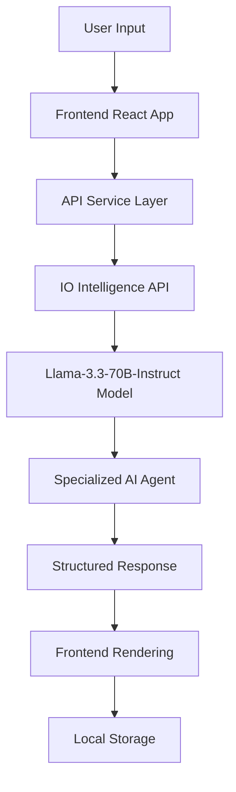

# HackMVP - AI-Powered Hackathon Co-Pilot


## 🚀 Overview

**HackMVP** is an AI-powered hackathon co-pilot that transforms rough ideas into fully functional MVPs in minutes. Built with cutting-edge AI agents powered by **IO Intelligence's Llama-3.3-70B-Instruct** model, HackMVP provides a comprehensive toolkit for hackathon success.

## SNAPSHOTS:


### ✨ Key Features

- 🧠 AI Idea Refinement - Transform vague concepts into actionable project plans
- 🔧 Smart Prompt Generation - Create optimized prompts for development tools
- 📊 Pitch Deck Creation - Generate compelling presentations automatically
- 🎬 Video Script Generation - Create engaging demo video scripts
- 📦 MVP Kit Builder - Complete project structure with tech stack recommendations
- ✅ Project Checklists - Comprehensive task management for hackathon success
- 🧱 Component Generator - Generate UI components from natural language prompts
- 🧪 Test Case Generator - Instantly create unit, integration, and E2E test cases
- 📱 Mobile-First Design - Fully responsive across all devices
- 🌙 Dark Theme - Beautiful dark interface with animated backgrounds

## 🤖 IO Intelligence Integration

### Model Architecture

HackMVP leverages the **Meta Llama-3.3-70B-Instruct** model through IO Intelligence's API to power multiple specialized AI agents:

```typescript
// Core AI Service Configuration
class ApiService {
  private apiKey: string;
  private modelName: string = 'meta-llama/Llama-3.3-70B-Instruct';
  private baseURL: string = 'https://api.intelligence.io.solutions/api/v1/';
}
```

### AI Agent Specialization

Each step in the HackMVP workflow is powered by a specialized AI agent with custom system prompts:

#### 1. **Idea Refinement Agent**
```typescript
{
  role: 'system',
  content: 'You are an AI hackathon co-pilot that helps developers refine ideas, generate tech stacks, create prompts, build MVPs, create pitch decks, video scripts, and project checklists.'
}
```

#### 2. **Prompt Engineering Agent**
```typescript
{
  role: 'system',
  content: 'You are an expert prompt engineer. Generate detailed, optimized prompts for development tools and AI assistants based on project requirements.'
}
```

#### 3. **Pitch Deck Agent**
```typescript
{
  role: 'system',
  content: 'You are an expert pitch deck creator for hackathons. Generate comprehensive pitch deck content with slide structure, compelling narrative, and presentation tips.'
}
```

#### 4. **Video Script Agent**
```typescript
{
  role: 'system',
  content: 'You are an expert video script writer for product demos and hackathon presentations. Create engaging, concise scripts with clear scene directions.'
}
```

#### 5. **MVP Kit Agent**
```typescript
{
  role: 'system',
  content: 'You are an expert MVP generator. Generate a comprehensive MVP kit with detailed title, description, tech stack, features, timeline, code structure, and deployment configuration.'
}
```

#### 6. **Project Management Agent**
```typescript
{
  role: 'system',
  content: 'You are an expert project manager for hackathons. Generate comprehensive project checklists with categorized tasks, timelines, and milestones.'
}
```

#### 7. **Component Generator Agent**
```typescript
{
  role: 'system',
  content: 'You are a UI component generator. Given a user prompt, generate React components using TailwindCSS (or Chakra UI, React Native, or Flutter if specified). Provide production-ready, responsive, and clean code.'
}
```

#### 8. **Test Case Generator Agent**
```typescript
{
  role: 'system',
  content: 'You are an expert software test engineer. Given source code, generate relevant unit tests (e.g., Jest, Mocha), integration tests (e.g., Playwright/Cypress), or API tests with appropriate structure and mock data.'
}
```


### API Communication Flow



## 🏗️ Architecture Overview

### Frontend Architecture

```
src/
├── components/
│   ├── common/           # Shared components
│   │   ├── Header.tsx
│   │   ├── AnimatedBackground.tsx
│   │   └── MarkdownRenderer.tsx
│   ├── dashboard/        # Main workflow components
│   │   ├── Dashboard.tsx
│   │   ├── IdeaRefiner.tsx
│   │   ├── PromptBuilder.tsx
│   │   ├── PitchDeckGenerator.tsx
│   │   ├── VideoScriptGenerator.tsx
│   │   ├── MVPKit.tsx
│   │   └── ChecklistGenerator.tsx
│   └── landing/          # Landing page components
├── pages/                # Route pages
├── services/             # API and business logic
├── utils/                # Utilities and local storage
└── styles/               # Global styles and themes
```

### State Management

HackMVP uses React's built-in state management with local storage persistence:

```typescript
interface WorkflowData {
  originalIdea: string;
  refinedDescription: string;
  generatedPrompt: string;
  pitchDeck: any;
  videoScript: any;
  mvpKit: any;
  checklist: any;
}
```

### Local Storage Strategy

```typescript
// Persistent storage for different data types
export const LOCAL_STORAGE_KEYS = {
  PROJECTS: 'hackmvp_projects',
  CHAT_HISTORY: 'hackmvp_chat_history',
  CHECKLISTS: 'hackmvp_checklists',
} as const;
```

## 🛠️ Installation & Setup

### Prerequisites

- Node.js 18+ 
- npm or yarn
- IO Intelligence API key

### Firebase Setup Steps
- Go to https://console.firebase.google.com
- Create a new project → Give it a name → Click "Continue" → Complete setup
- In the project dashboard, go to Build > Authentication
- Click on "Get started" under Authentication
- Go to the "Sign-in method" tab
- Enable "Email/Password" → Click the pencil/edit icon → Toggle to "Enable" → Save
- Enable "Google" provider → Click the pencil/edit icon
- Select a support email
- Leave other settings default
- Click Save
- Go to Project Settings (⚙️ gear icon top left > Project settings)
  Under General > Your Apps, register a new Web App
- Give it a nickname (e.g. "Web App")
- Click Register App (you can skip Firebase Hosting setup)
- Copy the Firebase config object shown there — you'll need it for .env

### Environment Configuration

Create a `.env` file in the root directory:

```env
VITE_IO_API_KEY=your_io_intelligence_api_key_here
VITE_IO_MODEL_NAME=meta-llama/Llama-3.3-70B-Instruct

# for setting up firebase.
VITE_FIREBASE_API_KEY=your_api_key
VITE_FIREBASE_AUTH_DOMAIN=your_project_id.firebaseapp.com
VITE_FIREBASE_PROJECT_ID=your_project_id
VITE_FIREBASE_STORAGE_BUCKET=your_project_id.appspot.com
VITE_FIREBASE_MESSAGING_SENDER_ID=your_sender_id
VITE_FIREBASE_APP_ID=your_app_id

```

### Installation Steps

1. **Clone the repository**
```bash
git clone https://github.com/yourusername/hackmvp.git
cd hackmvp
```

2. **Install dependencies**
```bash
npm install
```

3. **Set up environment variables**
```bash
cp .env.example .env
# Edit .env with your IO Intelligence API key
```

4. **Start development server**
```bash
npm run dev
```

5. **Build for production**
```bash
npm run build
```

## 🎯 How It Works

### Step-by-Step Workflow

#### 1. **Idea Refinement** 🧠
- User inputs a rough hackathon idea
- AI agent analyzes and refines the concept
- Generates detailed project requirements
- Provides actionable development plan

#### 2. **Prompt Generation** 🔧
- Selects project type (Website, Mobile App, API, etc.)
- AI creates optimized prompts for development tools
- Generates specific technical requirements
- Provides copy-ready prompts for AI assistants

#### 3. **Pitch Deck Creation** 📊
- AI generates comprehensive presentation structure
- Creates slide-by-slide content breakdown
- Provides presentation tips and best practices
- Generates compelling narrative flow

#### 4. **Video Script Development** 🎬
- Creates detailed video script for product demos
- Provides scene-by-scene breakdown
- Includes visual cues and production notes
- Optimized for hackathon presentations

#### 5. **MVP Kit Generation** 📦
- Recommends optimal tech stack
- Generates project structure and architecture
- Provides implementation timeline
- Creates deployment configuration

#### 6. **Project Checklist** ✅
- Comprehensive task breakdown by categories
- Timeline and milestone planning
- Progress tracking with completion status
- Exportable checklist format

#### 7. Component Generator 🧱
- User provides a UI description (e.g., "a sidebar with filters for size, price, and color")
- AI agent generates production-ready React components using TailwindCSS
- Supports Chakra UI, React Native, and Flutter options
- Exports reusable code blocks ready for development

#### 8. Test Case Generator 🧪
### Paste source code or describe functionality
- AI auto-generates:
- Unit tests (e.g., using Jest)
- Integration tests (e.g., Playwright, Cypress)
- E2E tests with mocked API and assertions
- Provides ready-to-run test files and structure suggestions

## 🚀 Deployment

### Build Process

```bash
# Install dependencies
npm install

# Build for production
npm run build

# Preview production build
npm run preview
```

### Environment Variables for Production

```env
VITE_IO_API_KEY=your_production_api_key
VITE_IO_MODEL_NAME=meta-llama/Llama-3.3-70B-Instruct
```

## 🤝 Contributing

1. Fork the repository
2. Create a feature branch (`git checkout -b feature/amazing-feature`)
3. Commit your changes (`git commit -m 'Add amazing feature'`)
4. Push to the branch (`git push origin feature/amazing-feature`)
5. Open a Pull Request

### Development Guidelines

- Follow TypeScript best practices
- Maintain mobile-first responsive design
- Write comprehensive component documentation
- Test across multiple screen sizes
- Ensure accessibility compliance

## 📄 License

This project is licensed under the MIT License - see the [LICENSE](LICENSE) file for details.

## 🙏 Acknowledgments

- **IO Intelligence** for providing the powerful Llama-3.3-70B-Instruct model
- **React Team** for the amazing framework
- **Tailwind CSS** for the utility-first CSS framework
- **Lucide React** for the beautiful icon library
- **Vite** for the lightning-fast build tool
